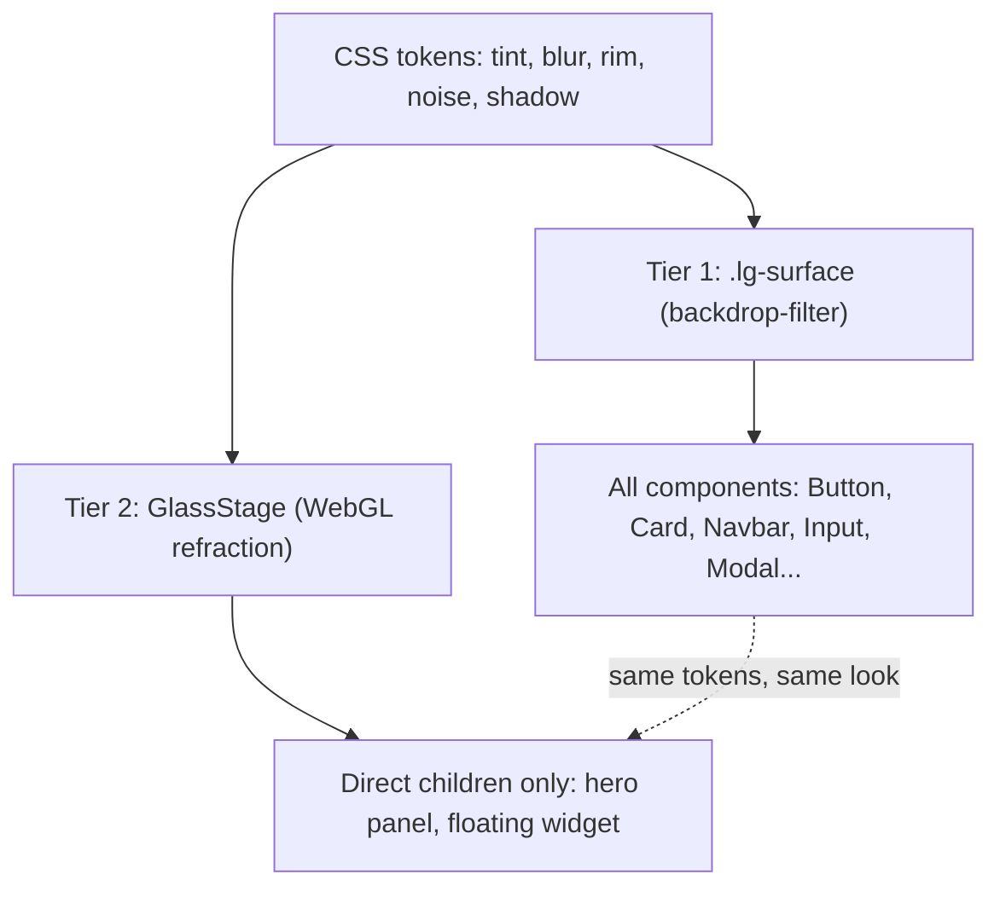

# Liquid Glass Library — Project Plan

A premium glassmorphic React component library with a real WebGL refraction tier.

**Location:** `C:\Users\addis\Desktop\Liquid-Glass-Library`

---

## 1. Overview

A two-tier glassmorphic component library:

1. A **portable CSS material layer** that every component is built on.
2. An **opt-in WebGL refraction tier** for hero elements.

Shipped alongside a showcase app that consumes the library, so the components are
always dogfooded rather than only existing in isolation.

---

## 2. Framework decision

**React + TypeScript, built on a standalone CSS layer.**

Reasoning:

- The hard part of this library is the **material**, not the component logic.
  Keeping the look in plain CSS with custom properties makes it portable — a Web
  Component or Vue wrapper later reuses the same stylesheet instead of
  reimplementing the visual system from scratch.
- React provides typed props, composition, and the accessibility primitives that
  make a component library genuinely usable, with by far the largest audience.
- Vite library mode handles the build. The same repo holds the showcase app.

**Storybook is deliberately skipped for now.** A showcase site built *with* the
library sells a visual library far better than isolated stories, and it avoids a
second build config competing with Vite's.

### Toolchain (installed)

- React 19.2.8 / React DOM 19.2.8
- Vite 8.1.5 with `@vitejs/plugin-react` 6.0.4
- TypeScript 7.0.2 (strict, plus `noUncheckedIndexedAccess`)
- `vite-plugin-dts` 5.0.3 for rolled-up type declarations

---

## 3. The two-tier material



**Tier 1 (default, every component).** `backdrop-filter` frosted glass. Cheap,
composes anywhere, scales to hundreds of elements on a page.

**Tier 2 (opt-in).** Real WebGL refraction via `@ybouane/liquidglass`, reserved
for one or two showpiece elements.

Both tiers read the same design tokens, so a Tier 2 element sits next to Tier 1
elements without looking like a different material.

---

## 4. Verified Tier 2 constraints

These were confirmed by reading the library source
(`@ybouane/liquidglass/src/LiquidGlass.ts`) rather than assumed, and each one
directly shapes the public API.

### Glass elements must be direct children of the root

```js
// _setupGlassElements, line 334
if (el.parentElement !== this.root) {
  console.warn('LiquidGlass: glass element must be a direct child of root, skipping.', el);
  this.glassSet.delete(el);
  continue;
}
```

A nested element is **silently dropped** with only a console warning. So Tier 2
cannot be a simple prop on a nested `<Button>`. It has to be a `<GlassStage>`
component that owns the root, where only its *direct* children may use the
`refraction` variant. The API must surface that structural requirement loudly
instead of letting it fail quietly.

### Non-media DOM behind glass is expensive

Anything that is not `canvas` / `img` / `video` behind a glass panel is
rasterized through `html-to-image`, and re-captured on **any** subtree mutation.
WebGL glass over live text or lists is impractical. Over images, canvas or video
it takes a fast `drawImage` path. Tier 2 is therefore documented as "for media
and imagery backdrops."

### Free interaction states

- `button: true` wires up hover and press shader states via
  `_setupButtonListeners` — brightness on hover, `zRadius` and `shadowSpread` on
  press. Real press physics in the shader, no work required from us.
- `floating: true` gives drag, and Lumen's `motion.ts` throw physics can be
  dropped in if we want a flingable widget.

### Documented footguns

- **Any `<video>` or `[data-dynamic]` inside the root forces every-frame
  re-renders for every glass element** (`_detectDynamic`).
- **Moving a glass element yourself does not trigger a re-render.** The frame
  loop early-outs unless something is explicitly dirty, something is
  `data-dynamic`, or the library's *own* drag is active. Move it via your own
  transform and the stale texture rides along with the element. Learned the hard
  way in Lumen.
- **Cost is per element, per frame, scaling with area times DPR squared.**
  Nothing in the glass config reduces per-pixel work — the shader always takes
  six texture samples per pixel and always evaluates its noise, regardless of
  `chromAberration`, `blurAmount` or `distortion`. Area is the only real lever.

---

## 5. What makes it look premium rather than generic

This is where the library earns its keep — most glassmorphism gets these wrong.
Each becomes a token plus a layer in `.lg-surface`.

- **Saturation boost in the backdrop filter** — `blur(20px) saturate(180%)`, not
  blur alone. This is what makes colors behind the glass bloom, and it is the
  single biggest tell between real and fake.
- **Asymmetric rim light** — a gradient border brighter at the top-left, not a
  uniform 1px stroke. Achieved with a masked pseudo-element.
- **Inset specular highlight** on the top edge plus a faint inner shadow on the
  bottom, so the panel reads as having actual thickness.
- **Microtexture** — an SVG noise overlay at 2 to 4 percent. Removing the
  perfectly smooth gradient is what kills the "plastic" look.
- **Layered shadows** — a tight contact shadow plus a wide ambient one, rather
  than a single soft blur.
- **Consistent light direction** across every component, enforced by a token
  rather than per-component values.
- **Chromatic edge fringe** — a barely-perceptible complementary hue at the rim,
  faking dispersion.
- **Adaptive contrast** — sample backdrop luminance and flip text and tint so
  glass stays legible over arbitrary photos. Ported from Lumen's `applyUiTheme`.
  Very few libraries do this, and it is the difference between a demo and
  something usable in production.
- **A light surround that is a different material, not an inverted one.** Glass
  over a bright page is a *white* frosted pane; tinting it dark at low alpha
  gives it no highlight to catch and no body of its own, and it lands as a grey
  card. The shadow-side rim, not the white lit edge, is what draws the
  silhouette; shadows need roughly double the alpha; and the grain has to switch
  from `overlay` to `multiply`, because `overlay` converges on a no-op as the
  backdrop approaches white. This is the failure mode nearly every glass library
  ships with, because the light theme is written as a text-colour swap.
- **Derived tokens have to be re-declared wherever a leaf can change.** A
  custom property whose value contains `var()` is substituted on the element
  that *declares* it, not on the one that uses it, so a composite written once
  on `:root` inherits everywhere as a finished string. Every subtree theme,
  every component that tunes its own glass, and every hover state works by
  changing a leaf below `:root` — which means all of them silently do nothing
  unless the composite is declared again where the change happens. This is easy
  to ship without noticing, because the defaults are correct and the page looks
  finished; it is only wrong in the states nobody screenshots.
- **Something behind the glass worth blurring.** Blurring a smooth gradient
  returns the same smooth gradient, so a panel over an even field is
  indistinguishable from a flat translucent rectangle however well the material
  is tuned. A 20px blur also erases a 1px grid line completely — only features
  wider than the blur radius survive. Every showcase surface needs a hard edge
  crossing its rim, crisp outside and soft within.

---

## 6. Repo shape

```
Liquid-Glass-Library/
  src/lib/                  the published library
    styles/
      tokens.css            design tokens; surround-independent, then two themes
      surface.css           the .lg-surface material
      index.css             import order, owns the cascade
    primitives/
      GlassSurface.tsx      the shared material primitive
      useAdaptiveContrast.ts
    components/
      Button/  Card/  Navbar/  Input/  Switch/  Modal/  Tooltip/  Tabs/
    webgl/
      GlassStage.tsx        Tier 2 root
      useLiquidGlass.ts
    index.ts                public exports
  src/site/                 documentation site, consumes src/lib
    components/             site chrome: TopBar, SideNav, CodeBlock, Example...
    sections/               one file per documentation section
    theme.ts                light/dark switching, persisted
    site.css  showcase.css
  index.html                site entry, incl. the blocking theme bootstrap
  vite.config.ts            site build -> dist-site/
  vite.lib.config.ts        library build (ESM + CJS + types) -> dist/
  tsconfig.json
```

Two Vite configs rather than one with modes, because the outputs differ
genuinely: the site is an app with hashed assets, the library is externalized
ESM plus rolled-up types with a single extracted stylesheet.

`tokens.css` is in three parts: the constants, then the *composites* built out
of leaf tokens, then the two surround themes, which set only leaves.

The composites carry a wider selector than the constants, and that is the
load-bearing detail of the file. A custom property containing `var()` is
substituted at computed-value time **on the element that declares it**, not
where it is eventually used — so a composite declared only on `:root` inherits
everywhere as a finished string and re-declaring a leaf further down the tree
does nothing. They are therefore declared again on each theme hook and on
`.lg-surface`, written once and reused via the selector list, at zero
specificity so component rules still win.

---

## 7. Milestones

- [x] **scaffold** — Vite + React + TypeScript, strict tsconfig, library mode
      build config, demo app entry consuming `src/lib`
- [x] **tokens** — the design token layer: tint, blur, saturation, rim light
      direction, noise opacity, layered shadow scales, radii, motion curves
- [x] **surface** — the `.lg-surface` material and `GlassSurface` primitive:
      backdrop-filter with saturation, asymmetric gradient rim, inset specular,
      SVG noise microtexture, layered shadows. *This is the make-or-break visual
      work.*
- [x] **adaptive-contrast** — port Lumen's luminance sampling into a
      `useAdaptiveContrast` hook so glass stays legible over arbitrary backdrops
- [x] **button** — variants (primary / secondary / ghost), sizes, icon and
      loading states, spring hover and press motion, full keyboard and
      `focus-visible` support
- [x] **core-interactive** — Input, Switch and Tabs, sharing the surface
      primitive and focus ring treatment
- [x] **layout-overlay** — Card, Navbar (scroll-aware blur intensity) and Modal
      (glass backdrop with proper focus trap and scroll lock)
- [x] **tooltip** — Tooltip with positioning that survives viewport edges,
      factored into a `useAnchoredPosition` hook. *Popover deferred; the hook is
      the reusable half and it exists.*
- [x] **webgl-tier** — `GlassStage` plus `GlassPanel`: enforce the direct-child
      constraint at the API level with a dev-time warning, wire `button: true`
      for free shader press states
- [x] **demo-site** — showcase app dogfooding every component, with a Tier 1 vs
      Tier 2 side-by-side comparison and an adaptive-contrast demo. *Backdrop is
      generated rather than photographic, to keep the repo free of binary assets
      and licensing questions.*
- [x] **polish** — reduced-motion support, `backdrop-filter` fallbacks,
      `forced-colors` and `prefers-contrast` handling, accessibility audit,
      README
- [x] **docs-site** — the demo replaced by a real documentation site: sticky
      chrome, sidebar with scrollspy, live examples paired with their source,
      prop tables, a token playground and a self-contained syntax highlighter.
      *No highlighting dependency; a single-pass tokenizer covers the three
      languages the page actually shows.*
- [x] **surround-themes** — light and dark as two real themes rather than a text
      swap. Every hard-coded alpha in the library re-expressed against
      `--lg-tint-scale`, `--lg-shadow-strength` and `--lg-line`, so a theme is a
      handful of leaves. *Found and fixed a matching bug in
      `useAdaptiveContrast`: it only ever had a dark-surround set to switch to,
      so it worked in one direction and coincidentally agreed with the defaults
      in the other.*
- [x] **token-substitution** — the composites re-declared on every theme hook
      and on `.lg-surface`, so that changing a leaf below `:root` actually
      resolves. This was the bug behind most of the library's dynamic
      behaviour: hover and press tint and blur, the Navbar's scroll ramp, the
      Modal's heavier glass, the primary Button's accent rim, `.lg-theme-*` on
      a subtree, and every token `useAdaptiveContrast` writes were all inert.
      Navbar and Modal now override the composites rather than the leaves they
      are built from, which also keeps their tuning from inheriting into the
      surfaces nested inside them. *Verified in a real browser rather than by
      reading: the failure mode is invisible in the resting state.*
- [x] **site-fixes** — the sticky anatomy stage constrained to its own row
      (Chrome constrains a sticky *grid item* to the grid container, not its
      grid area, so it slid over the code block beneath it); the Tier 2 panel's
      layout no longer overridden by a `[data-refraction]` rule the consumer
      could not outrank; and the refraction stage no longer re-initialises
      forever — panel registration and renderer status were in one context, so
      each drove the other and the shaders recompiled about twice a second.

---

## 8. Deferred until the core is proven

- npm publishing and versioning
- A Web Component wrapper (the CSS layer is built to make this cheap)
- Storybook
- Popover — a click-triggered, focus-managed sibling of Tooltip. The hard half,
  edge-aware positioning, is already done in `useAnchoredPosition`.
- A test suite. The focus trap, the roving tab stop and the luminance maths are
  the three things worth testing, and all three are currently verified by hand.
- Bundled (rolled-up) type declarations. `vite-plugin-dts` can do it via
  `@microsoft/api-extractor`, which does not yet support TypeScript 7; the build
  emits per-file declarations behind a `dist/index.d.ts` entry instead.
